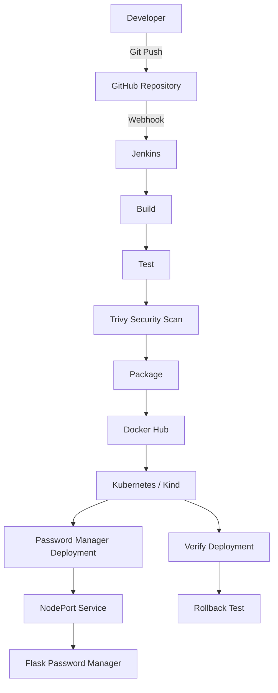
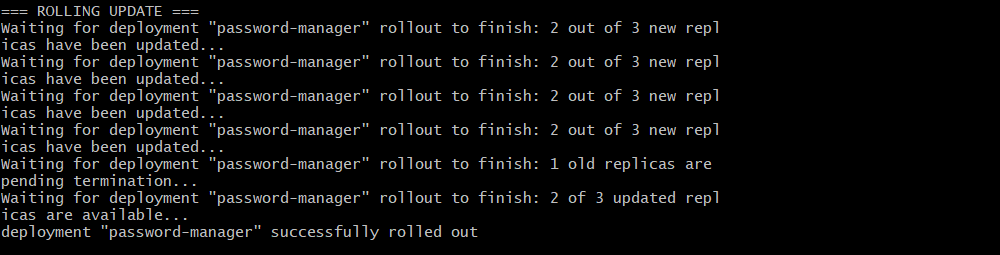
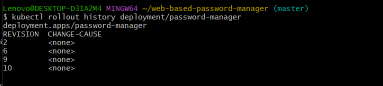

# 🔐 Web-Based Password Manager — DevSecOps CI/CD Project

A Flask-based password manager integrated with an end-to-end **DevOps and DevSecOps workflow** using **GitHub, Jenkins, Docker, Docker Hub, Kubernetes, Kind, and Trivy**.

This project demonstrates how an application can move from source-code changes through automated build, testing, container security scanning, image publishing, Kubernetes deployment, verification, and rollback.

---

## 📌 Project Overview

The application provides a simple web interface for managing credentials while demonstrating a complete containerized CI/CD workflow.

### Application Features

- User registration and login
- Password generation
- Password strength validation
- Password hashing
- Password encryption
- Add and update saved credentials
- Password expiry support
- Role-based password viewing
- SQLite-backed application data

### DevOps / DevSecOps Features

- GitHub source control
- GitHub webhook integration
- Jenkins CI/CD pipeline
- Automated Python and container validation
- Docker image build
- Non-root container execution
- Trivy vulnerability scanning
- CRITICAL vulnerability pipeline gate
- Docker Hub image publishing
- Kubernetes deployment
- Rolling update strategy
- Deployment verification
- Kubernetes rollback testing
- Kubernetes Secret-based encryption key injection

---

## 🏗️ Architecture



### CI/CD Flow

```text
Developer
    ↓
GitHub
    ↓
GitHub Webhook
    ↓
Jenkins
    ↓
Build
    ↓
Automated Tests
    ↓
Trivy Security Scan
    ↓
Docker Image
    ↓
Docker Hub
    ↓
Kubernetes
    ↓
Deployment Verification
    ↓
Rollback Test
```

---

## 🛠️ Technology Stack

| Technology | Purpose |
|---|---|
| Python | Application logic |
| Flask | Web application |
| SQLite | Local application database |
| Passlib | Password hashing |
| Cryptography / Fernet | Password encryption |
| Git & GitHub | Source control |
| Jenkins | CI/CD automation |
| Docker | Containerization |
| Docker Hub | Container registry |
| Trivy | Container vulnerability scanning |
| Kubernetes | Container orchestration |
| Kind | Local Kubernetes cluster |
| Bash | Validation and automation |
| ngrok | Local Jenkins webhook connectivity |

---

## 📁 Repository Structure

```text
web-based-password-manager/
│
├── app.py
├── web_app.py
├── key.py
├── requirements.txt
│
├── Dockerfile
├── .dockerignore
├── Jenkinsfile
├── test.sh
│
├── .env.example
├── .gitignore
│
├── k8s/
│   ├── deployment.yaml
│   └── service.yaml
│
├── screenshots/
│   ├── rolling-update.png
│   └── rollout-history.png
│
├── project-screenshots.pdf
└── README.md
```

---

## 🔐 Application Security

The application separates sensitive configuration from source code.

The encryption key is read from:

```text
ENCRYPTION_KEY
```

The repository includes:

```text
.env.example
```

while local secret files such as `.env` are excluded by `.gitignore`.

Stored account passwords are encrypted using **Fernet**, while application user passwords are hashed using **Passlib**.

---

## 🐳 Docker

The application is packaged as a Docker image based on:

```text
python:3.10-slim
```

The container:

- installs only the required Python dependencies
- runs as a dedicated non-root user
- exposes port `8000`
- includes a container health check
- excludes secrets, databases, virtual environments, and scanner artifacts through `.dockerignore`

### Build the Image

```bash
docker build -t nidhi8901/web-based-password-manager .
```

### Run Locally

The application requires an encryption key:

```bash
docker run --rm \
  -e ENCRYPTION_KEY="your-encryption-key" \
  -p 8000:8000 \
  nidhi8901/web-based-password-manager
```

Then open:

```text
http://localhost:8000
```

---

## 🧪 Automated Validation

The project includes a Bash validation script:

```text
test.sh
```

It checks:

- Python syntax
- required Python packages
- required project files

Run it with:

```bash
chmod +x test.sh
./test.sh
```

The Jenkins pipeline performs additional container-level validation, including a check that the image is not running as root.

---

## 🛡️ DevSecOps Security Scanning

The Jenkins pipeline integrates **Trivy** for container image scanning.

The pipeline:

1. reports `HIGH` and `CRITICAL` vulnerabilities
2. runs a separate `CRITICAL` vulnerability gate
3. fails the security stage if a CRITICAL vulnerability is detected

```text
Docker Image
    ↓
Trivy Scan
    ↓
HIGH + CRITICAL Report
    ↓
CRITICAL Gate
    ↓
Continue / Fail Pipeline
```

### Recorded Security Improvement

The documented project scan improved from:

```text
Before:
CRITICAL: 3
HIGH:     54
Total:    180
```

to:

```text
After:
CRITICAL: 0
HIGH:     44
Total:    152
```

The remaining findings still require ongoing base-image and dependency maintenance.

---

## ⚙️ Jenkins CI/CD Pipeline

The pipeline is defined in:

```text
Jenkinsfile
```

### Pipeline Stages

```text
Checkout
   ↓
Build
   ↓
Test
   ↓
Security Scan
   ↓
Package
   ↓
Docker Push
   ↓
Deploy
   ↓
Verify
   ↓
Rollback Test
```

### Docker Image Tags

Each Jenkins build creates:

```text
nidhi8901/web-based-password-manager:<BUILD_NUMBER>
```

and also publishes:

```text
nidhi8901/web-based-password-manager:latest
```

Docker Hub authentication is handled using the Jenkins credential:

```text
dockerhub_cred
```

---

## 🌐 GitHub Webhook

GitHub is connected to Jenkins through a webhook.

```text
GitHub Push
    ↓
GitHub Webhook
    ↓
Jenkins Pipeline
```

For the local Jenkins environment, ngrok was used to expose Jenkins for webhook delivery.

The Jenkins webhook endpoint is:

```text
/github-webhook/
```

---

## ☸️ Kubernetes Deployment

The application is deployed to Kubernetes using the manifests in:

```text
k8s/
├── deployment.yaml
└── service.yaml
```

### Deployment

The Kubernetes Deployment uses:

```text
Replicas: 3
Container Port: 8000
Strategy: RollingUpdate
maxUnavailable: 1
maxSurge: 1
```

The application encryption key is supplied through:

```text
password-manager-secret
```

as:

```text
ENCRYPTION_KEY
```

The real secret manifest is not committed to the repository.

### Service

The application is exposed through a `NodePort` Service:

```text
Service Port: 8000
Target Port: 8000
NodePort: 30080
```

---

## 🔄 Rolling Updates & Rollback

The Kubernetes Deployment uses the `RollingUpdate` strategy so updates can be deployed incrementally.

### Check Deployment History

```bash
kubectl rollout history deployment/password-manager
```

### Check Rollout Status

```bash
kubectl rollout status deployment/password-manager
```

### Roll Back

```bash
kubectl rollout undo deployment/password-manager
```

The Jenkins pipeline also contains a dedicated rollback-test stage.

---

## 🔎 Deployment Verification

Useful verification commands include:

```bash
kubectl get deployment password-manager
kubectl get pods -l app=password-manager -o wide
kubectl get service password-manager-service
kubectl rollout status deployment/password-manager
```

---

## 📸 Project Evidence

### Kubernetes Rolling Update



### Kubernetes Rollout History



### Full Project Screenshots

Additional implementation screenshots are available here:

[📄 View Project Screenshots PDF](project-screenshots.pdf)

---

## 🔒 Repository Security

The repository excludes sensitive or generated files including:

```text
.env
*.db
*.sqlite
*.sqlite3
passwords.json
__pycache__/
trivy.exe
trivy.zip
trivy-before.txt
trivy-after.txt
trivy-high-critical.txt
```

This helps prevent local credentials, databases, and scanner artifacts from being committed.

---

## 🎯 Skills Demonstrated

This project demonstrates practical experience with:

- Linux
- Git and GitHub
- GitHub Webhooks
- Jenkins
- CI/CD pipelines
- Docker
- Docker Hub
- Container hardening
- Non-root containers
- Trivy
- Environment variables
- Jenkins credentials
- Kubernetes
- Deployments
- Services
- Secrets
- Rolling updates
- Deployment verification
- Rollback
- Kind
- Flask
- Python
- Bash

---

## 💡 Key Learning Outcomes

This project demonstrates how application development and DevOps practices can be combined into one workflow:

```text
Code
  ↓
Source Control
  ↓
CI/CD Automation
  ↓
Automated Validation
  ↓
Container Security
  ↓
Image Registry
  ↓
Kubernetes Deployment
  ↓
Verification
  ↓
Rollback
```

It provides hands-on experience with the application lifecycle from source-code change to containerized deployment and recovery.

---

## 👩‍💻 Author

**Nidhi Kumari**

GitHub: [Nidhi8901](https://github.com/Nidhi8901)

LinkedIn: [Nidhi Kumari](https://www.linkedin.com/in/nidhi-kumari-ba2a1a361)

---

⭐ If you found this project useful, consider starring the repository.
